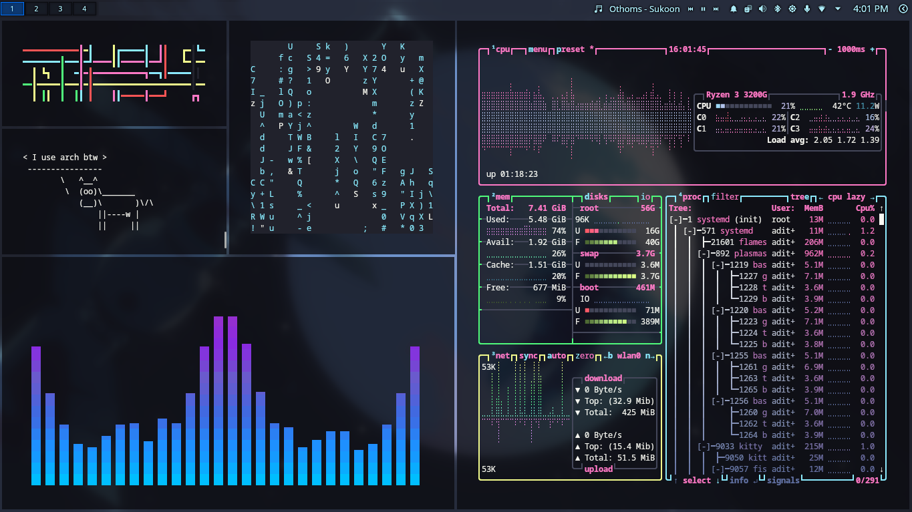
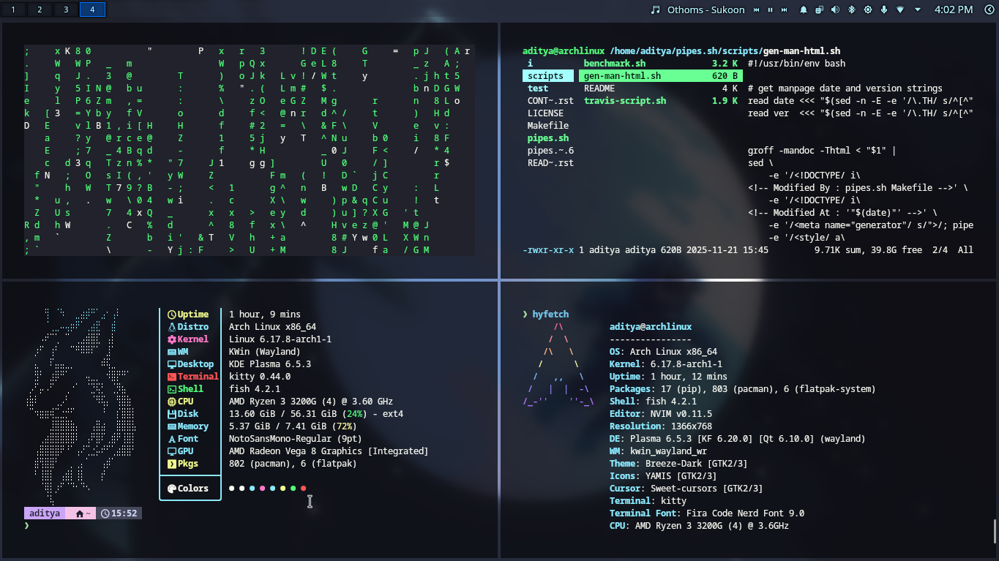
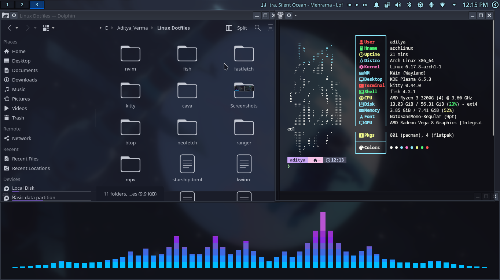

# My KDE Dotfiles

A curated collection of KDE configuration files and related settings to reproduce
a personalized KDE environment. This repository includes window manager and
desktop settings, shell and terminal configs, Neovim configuration with plugins,
and helper tool configs (btop, cava, fastfetch, neofetch, ranger).

Contents
- KDE: `kwinrc`, `krunnerrc`, `dolphinrc`, `kwinrulesrc`, etc.
- Shell: `fish` (in `fish/`)
- Terminal: `kitty/` configuration
- Editor: `nvim/` (init and lua config + plugins)
- Tools: `btop/`, `cava/`, `fastfetch/`, `neofetch/`, `ranger/`

Screenshots

Below are screenshots from this configuration. Click any image to view full-size.

Usage
- Inspect the files and copy the ones you want into your home configuration
  directories (for example, `~/.config/kwinrc`, `~/.config/kitty/`, etc.).
- Review configs before applying — some values may be machine- or distro-specific.

Contributing
- Feel free to open issues or PRs to improve the configs.

Acknowledgements
- Collected and organized by the repository owner.
